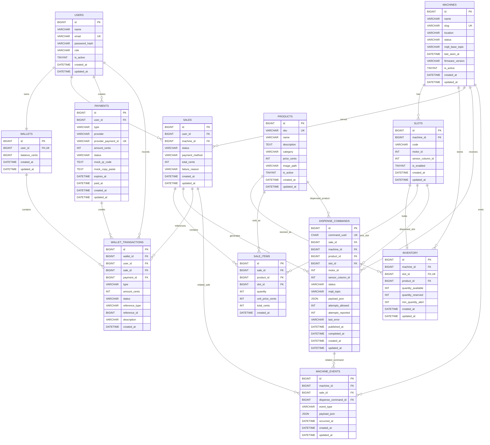

# MySQL DER

Versao textual em Mermaid do DER MySQL da plataforma.

```mermaid
erDiagram
  USERS ||--|| WALLETS : owns
  USERS ||--o{ SALES : makes
  USERS ||--o{ PAYMENTS : creates
  USERS ||--o{ WALLET_TRANSACTIONS : records
  WALLETS ||--o{ WALLET_TRANSACTIONS : contains

  MACHINES ||--o{ SLOTS : has
  MACHINES ||--o{ INVENTORY : stores
  MACHINES ||--o{ SALES : serves
  MACHINES ||--o{ DISPENSE_COMMANDS : receives
  MACHINES ||--o{ MACHINE_EVENTS : emits

  SLOTS ||--o| INVENTORY : holds
  PRODUCTS ||--o{ INVENTORY : stocked_as

  SALES ||--o{ SALE_ITEMS : contains
  PRODUCTS ||--o{ SALE_ITEMS : sold_as
  SLOTS ||--o{ SALE_ITEMS : source_slot

  SALES ||--o{ DISPENSE_COMMANDS : generates
  PRODUCTS ||--o{ DISPENSE_COMMANDS : dispensed_product
  SLOTS ||--o{ DISPENSE_COMMANDS : dispensed_slot

  SALES ||--o{ WALLET_TRANSACTIONS : references
  PAYMENTS ||--o{ WALLET_TRANSACTIONS : credits

  SALES ||--o{ MACHINE_EVENTS : related_sale
  DISPENSE_COMMANDS ||--o{ MACHINE_EVENTS : related_command

  USERS {
    BIGINT id PK
    VARCHAR name
    VARCHAR email UK
    VARCHAR password_hash
    VARCHAR role
    TINYINT is_active
    DATETIME created_at
    DATETIME updated_at
  }

  WALLETS {
    BIGINT id PK
    BIGINT user_id FK,UK
    BIGINT balance_cents
    DATETIME created_at
    DATETIME updated_at
  }

  MACHINES {
    BIGINT id PK
    VARCHAR name
    VARCHAR slug UK
    VARCHAR location
    VARCHAR status
    VARCHAR mqtt_base_topic
    DATETIME last_seen_at
    VARCHAR firmware_version
    TINYINT is_active
    DATETIME created_at
    DATETIME updated_at
  }

  SLOTS {
    BIGINT id PK
    BIGINT machine_id FK
    VARCHAR code
    INT motor_id
    INT sensor_column_id
    TINYINT is_enabled
    DATETIME created_at
    DATETIME updated_at
  }

  PRODUCTS {
    BIGINT id PK
    VARCHAR sku UK
    VARCHAR name
    TEXT description
    VARCHAR category
    INT price_cents
    VARCHAR image_path
    TINYINT is_active
    DATETIME created_at
    DATETIME updated_at
  }

  INVENTORY {
    BIGINT id PK
    BIGINT machine_id FK
    BIGINT slot_id FK,UK
    BIGINT product_id FK
    INT quantity_available
    INT quantity_reserved
    INT min_quantity_alert
    DATETIME created_at
    DATETIME updated_at
  }

  SALES {
    BIGINT id PK
    BIGINT user_id FK
    BIGINT machine_id FK
    VARCHAR status
    VARCHAR payment_method
    INT total_cents
    VARCHAR failure_reason
    DATETIME created_at
    DATETIME updated_at
  }

  SALE_ITEMS {
    BIGINT id PK
    BIGINT sale_id FK
    BIGINT product_id FK
    BIGINT slot_id FK
    INT quantity
    INT unit_price_cents
    INT total_cents
    DATETIME created_at
  }

  PAYMENTS {
    BIGINT id PK
    BIGINT user_id FK
    VARCHAR type
    VARCHAR provider
    VARCHAR provider_payment_id UK
    INT amount_cents
    VARCHAR status
    TEXT mock_qr_code
    TEXT mock_copy_paste
    DATETIME expires_at
    DATETIME paid_at
    DATETIME created_at
    DATETIME updated_at
  }

  WALLET_TRANSACTIONS {
    BIGINT id PK
    BIGINT wallet_id FK
    BIGINT user_id FK
    BIGINT sale_id FK
    BIGINT payment_id FK
    VARCHAR type
    INT amount_cents
    VARCHAR status
    VARCHAR reference_type
    BIGINT reference_id
    VARCHAR description
    DATETIME created_at
  }

  DISPENSE_COMMANDS {
    BIGINT id PK
    CHAR command_uuid UK
    BIGINT sale_id FK
    BIGINT machine_id FK
    BIGINT product_id FK
    BIGINT slot_id FK
    INT motor_id
    INT sensor_column_id
    VARCHAR status
    VARCHAR mqtt_topic
    JSON payload_json
    INT attempts_allowed
    INT attempts_reported
    VARCHAR last_error
    DATETIME published_at
    DATETIME completed_at
    DATETIME created_at
    DATETIME updated_at
  }

  MACHINE_EVENTS {
    BIGINT id PK
    BIGINT machine_id FK
    BIGINT sale_id FK
    BIGINT dispense_command_id FK
    VARCHAR event_type
    JSON payload_json
    DATETIME occurred_at
    DATETIME created_at
    DATETIME updated_at
  }
```
