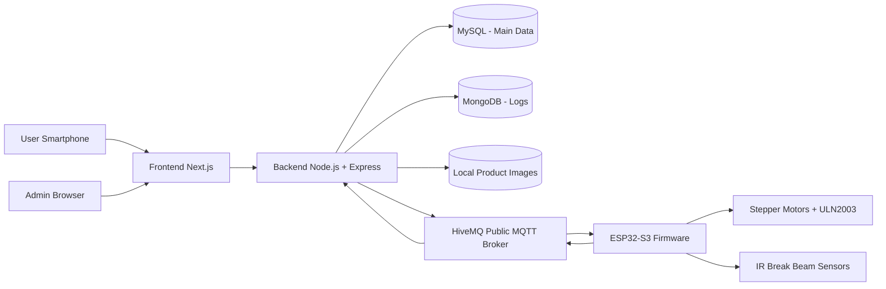

# Especificação Completa do Projeto — Plataforma Web Full Stack para Vending Machine IoT

**Versão:** 1.0  
**Status:** Especificação revisada com requisitos do enunciado da disciplina  
**Projeto:** Plataforma Web Full Stack para Gestão e Operação de Vending Machine IoT  
**Contexto acadêmico:** Trabalho de Desenvolvimento de Aplicação Web Full Stack + TCC de Máquina de Venda Inteligente com Arquitetura IoT  
**Autores do projeto acadêmico:** Lucas Pinotti de Brito e João Vitor Brandão Teixeira  
**Finalidade deste documento:** orientar o desenvolvimento completo da plataforma web, backend, frontend, bancos de dados, arquitetura MVC, serviços, middlewares, relatórios, logs, importação/exportação, integração MQTT e documentação exigida pela disciplina.

---

## 1. Visão geral

Este projeto consiste em uma aplicação web full stack para gestão e operação de uma vending machine inteligente integrada a uma ESP32-S3. A plataforma permite que usuários acessem a máquina por QR Code, visualizem os produtos disponíveis, autentiquem-se com e-mail e senha, consultem saldo, recarreguem saldo em modo mockado, comprem um produto por vez e acompanhem o status da dispensação física.

Além do fluxo do usuário final, o sistema possui painel administrativo para gerenciar máquinas, slots, produtos, estoque, usuários, vendas, pagamentos, relatórios, gráficos, logs, importação/exportação de dados e eventos operacionais da máquina.

A aplicação deve cumprir os requisitos obrigatórios do enunciado da disciplina de Desenvolvimento de Aplicação Web Full Stack. Por isso, esta versão da especificação substitui a arquitetura anterior baseada em FastAPI/Supabase PostgreSQL por uma arquitetura aderente ao trabalho:

- **Backend:** Node.js + Express.
- **Frontend:** Next.js/React, utilizando HTML5, CSS3 e JavaScript.
- **Banco relacional principal:** MySQL.
- **Banco NoSQL:** MongoDB exclusivamente para logs do sistema.
- **Arquitetura:** MVC + Service Layer + Router + Middleware.
- **Autenticação:** JWT próprio no backend.
- **Infraestrutura local:** Docker Compose com 4 serviços principais: backend, frontend, MySQL e MongoDB.

O módulo IoT/MQTT permanece como diferencial do projeto e do TCC. A ESP32-S3 e o firmware ficarão em pasta separada, fora do núcleo obrigatório da aplicação web, mas a plataforma já será projetada para se comunicar com a máquina via MQTT.

---

## 2. Objetivos do projeto

### 2.1 Objetivo geral

Desenvolver uma plataforma web full stack para controle de uma vending machine inteligente, atendendo aos requisitos da disciplina e mantendo compatibilidade com a integração IoT do TCC.

### 2.2 Objetivos acadêmicos da disciplina

A plataforma deve demonstrar domínio dos seguintes conceitos:

1. Desenvolvimento web full stack.
2. Backend com Node.js + Express.
3. Frontend com HTML5, CSS3, JavaScript e React/Next.js.
4. Arquitetura MVC + Service Layer + Router + Middleware.
5. Orientação a objetos.
6. Uso de interfaces obrigatórias: DAO, Controller e Service.
7. Persistência de dados principais em MySQL.
8. Uso de MongoDB para logs do sistema.
9. Middlewares de autenticação, logging, validação e tratamento de erros.
10. CRUD completo.
11. Pesquisa e filtros.
12. Importação e exportação JSON.
13. Exportação de logs em XML.
14. Relatórios em PDF.
15. Gráficos no frontend com Chart.js.
16. Upload e exibição de imagens.
17. Geração de script SQL e DER.
18. Documentação técnica em PDF.
19. Demonstração em vídeo.

### 2.3 Objetivos funcionais do usuário final

O usuário final deve conseguir:

1. Acessar a máquina por QR Code.
2. Visualizar produtos disponíveis.
3. Criar conta com e-mail e senha.
4. Fazer login.
5. Visualizar saldo.
6. Recarregar saldo em modo mockado.
7. Comprar um produto por vez usando saldo interno.
8. Acompanhar o status da compra.
9. Consultar histórico de compras.
10. Relatar problema por meio de link externo para WhatsApp.

### 2.4 Objetivos funcionais do administrador

O administrador deve conseguir:

1. Gerenciar máquinas.
2. Gerenciar slots vinculados a máquinas.
3. Gerenciar produtos.
4. Fazer upload e exibir imagens de produtos.
5. Gerenciar inventário por slot.
6. Gerenciar usuários.
7. Visualizar vendas.
8. Visualizar pagamentos/recargas mockadas.
9. Visualizar eventos da máquina.
10. Visualizar logs do sistema.
11. Exportar logs em XML.
12. Importar produtos e inventário por JSON.
13. Exportar produtos e inventário em JSON.
14. Gerar relatório PDF de vendas por período e histórico.
15. Visualizar gráfico de vendas por mês.
16. Usar filtros e pesquisa em telas administrativas.

### 2.5 Objetivos do módulo IoT

A ESP32-S3 deve, em fase integrada:

1. Conectar-se à internet.
2. Conectar-se ao broker MQTT público HiveMQ.
3. Assinar o tópico de ações da máquina.
4. Receber comandos de dispensação.
5. Acionar motor associado ao slot solicitado.
6. Ler sensor IR da coluna associada ao slot.
7. Realizar uma segunda tentativa se o produto não for detectado.
8. Publicar sucesso ou falha.
9. Publicar heartbeat periódico.
10. Publicar eventos operacionais.

---

## 3. Escopo do MVP da plataforma web

O MVP da disciplina deve conter obrigatoriamente:

1. Backend Node.js + Express.
2. Frontend Next.js/React.
3. MySQL como banco principal.
4. MongoDB como banco de logs.
5. Docker Compose com backend, frontend, MySQL e MongoDB.
6. Login com JWT.
7. Middleware de autenticação.
8. Middleware de logging gravando no MongoDB.
9. Middleware global de erros.
10. Middleware de validação.
11. CRUD completo de pelo menos uma entidade principal; no projeto, haverá CRUD completo de máquinas, produtos, slots, inventário e usuários.
12. Importação/exportação JSON de `products` e `inventory`.
13. Exportação XML de logs do MongoDB.
14. Relatório PDF de vendas por período e histórico.
15. Gráfico de vendas por mês com Chart.js.
16. Upload local e exibição de imagens de produtos.
17. Pesquisa e filtros.
18. Script SQL completo.
19. DER do banco MySQL.
20. Documentação PDF da plataforma web.
21. Vídeo de demonstração.

---

## 4. Fora do escopo do MVP da disciplina

Os itens abaixo não entram como requisito obrigatório da entrega da disciplina, mas podem permanecer documentados como evolução futura ou integração complementar do TCC:

1. Compra sem cadastro.
2. Compra direta via Pix real sem saldo interno.
3. Login com Google.
4. Supabase Auth.
5. Supabase PostgreSQL.
6. Supabase Storage.
7. FastAPI.
8. PostgreSQL.
9. Carrinho com múltiplos produtos.
10. Controle de validade de produtos.
11. Reed switch para porta aberta.
12. Bloqueio por porta aberta.
13. TLS obrigatório no MQTT.
14. Assinatura HMAC dos comandos MQTT.
15. Identificação individual do produto dispensado.
16. Relatórios comerciais avançados além do relatório obrigatório.
17. Multioperador com permissões granulares.
18. OTA update da ESP32-S3.
19. Controle completo de seis motores no firmware inicial.
20. Integração obrigatória com provedor real de pagamentos.

---

## 5. Arquitetura geral

### 5.1 Visão geral dos serviços

A plataforma será executada localmente com Docker Compose usando quatro serviços principais:

```text
backend   -> Node.js + Express
frontend  -> Next.js/React
mysql     -> banco relacional principal
mongodb   -> banco NoSQL para logs
```

O broker MQTT será externo, usando HiveMQ público. O firmware ESP32-S3 ficará em pasta separada e não será serviço obrigatório do Docker Compose.

### 5.2 Diagrama de componentes



### 5.3 Separação entre plataforma web e firmware

A plataforma web será documentada e entregue como aplicação full stack. O firmware ficará em pasta separada, por exemplo:

```text
firmware/
```

A demonstração da disciplina deve focar na plataforma web. A parte IoT/MQTT pode ser apresentada como diferencial e conexão com o TCC, mas não substitui os requisitos web obrigatórios.

---

## 6. Stack técnica final

### 6.1 Backend

Stack obrigatória/recomendada:

- Node.js.
- Express.
- JavaScript.
- JWT para autenticação.
- bcrypt para hash de senha.
- mysql2 ou Sequelize para MySQL.
- MongoDB Driver ou Mongoose para logs.
- Multer para upload de imagens.
- Joi, Zod ou Yup para validação.
- xmlbuilder2 ou biblioteca equivalente para exportação XML.
- mqtt.js para comunicação com HiveMQ.
- dotenv para variáveis de ambiente.
- cors.
- helmet, opcional.
- morgan, opcional, sem substituir o `log_middleware` próprio.
- nodemon em desenvolvimento.

A decisão preferencial é usar **JavaScript puro**, evitando TypeScript no backend para não gerar divergência com o enunciado, que cita JavaScript com Node.js + Express.

### 6.2 Frontend

Stack recomendada:

- Next.js.
- React.
- JavaScript ou TypeScript. Preferência: JavaScript para aderência literal ao enunciado.
- HTML5.
- CSS3.
- TailwindCSS.
- shadcn/ui.
- Radix UI.
- Chart.js para gráficos.
- jsPDF ou pdfmake para geração de PDF no frontend.
- React Hook Form.
- Zod ou validação equivalente.
- Sonner ou equivalente para toasts.
- Fetch API ou Axios para comunicação com backend.

### 6.3 Banco relacional

Banco principal:

- MySQL 8.

Uso:

- Todas as entidades principais.
- Usuários.
- Carteiras.
- Máquinas.
- Slots.
- Produtos.
- Inventário.
- Vendas.
- Itens de venda.
- Pagamentos/recargas.
- Transações de carteira.
- Comandos de dispensação.

### 6.4 Banco NoSQL

Banco NoSQL:

- MongoDB.

Uso exclusivo:

- Logs do sistema.
- Logs de autenticação.
- Logs de acesso a rotas.
- Logs de inclusão/alteração/exclusão.
- Logs de erros e exceções.
- Logs operacionais relevantes.

### 6.5 MQTT

Broker:

- HiveMQ público.

Uso:

- Backend publica comandos para a ESP32-S3.
- ESP32-S3 publica status e eventos.

Tópicos:

```text
vending/{machine_id}/actions
vending/{machine_id}/events
vending/{machine_id}/status
```

---

## 7. Arquitetura obrigatória do backend

O backend deve seguir obrigatoriamente:

```text
MVC + Service Layer + Router + Middleware
```

### 7.1 MVC

- **Model:** representa as entidades e estruturas de dados do domínio.
- **View:** representada pelo frontend Next.js.
- **Controller:** recebe requisições, chama services e retorna respostas.

### 7.2 Service Layer

A camada Service centraliza regras de negócio, como:

- Validação de compra.
- Reserva de estoque.
- Baixa de estoque.
- Estorno.
- Geração de relatório.
- Importação/exportação JSON.
- Exportação XML.
- Geração de logs.
- Publicação MQTT.

### 7.3 Router

As rotas devem ser agrupadas por recurso e organizadas em classes separadas ou módulos equivalentes.

Recursos previstos:

- Auth.
- Users.
- Products.
- Machines.
- Slots.
- Inventory.
- Wallet.
- Sales.
- Payments.
- Reports.
- Charts.
- Logs.
- Import/Export.
- MQTT/Machine events.

### 7.4 Middleware

Middlewares obrigatórios:

1. `auth_middleware`.
2. `log_middleware`.
3. `error_middleware`.
4. `validation_middleware`.

---

## 8. Interfaces obrigatórias de POO

O enunciado exige as interfaces DAO, Controller e Service. Como o backend será em JavaScript, essas interfaces serão implementadas como classes base abstratas, com métodos obrigatórios lançando erro caso não sejam sobrescritos.

### 8.1 IDAO

Arquivo:

```text
backend/src/interfaces/IDAO.js
```

Contrato conceitual:

```js
class IDAO {
  async create(data) { throw new Error('Method create() must be implemented'); }
  async findAll(filters) { throw new Error('Method findAll() must be implemented'); }
  async findById(id) { throw new Error('Method findById() must be implemented'); }
  async update(id, data) { throw new Error('Method update() must be implemented'); }
  async delete(id) { throw new Error('Method delete() must be implemented'); }
}
```

Classes que devem implementar/herdar:

- UserDAO.
- ProductDAO.
- MachineDAO.
- SlotDAO.
- InventoryDAO.
- SaleDAO.
- WalletDAO.
- PaymentDAO.

### 8.2 IService

Arquivo:

```text
backend/src/interfaces/IService.js
```

Contrato conceitual:

```js
class IService {
  async create(data, context) { throw new Error('Method create() must be implemented'); }
  async findAll(filters, context) { throw new Error('Method findAll() must be implemented'); }
  async findById(id, context) { throw new Error('Method findById() must be implemented'); }
  async update(id, data, context) { throw new Error('Method update() must be implemented'); }
  async delete(id, context) { throw new Error('Method delete() must be implemented'); }
}
```

Classes que devem implementar/herdar:

- AuthService.
- ProductService.
- MachineService.
- SlotService.
- InventoryService.
- SaleService.
- WalletService.
- PaymentService.
- ReportService.
- ImportExportService.
- LogService.
- MqttService.

### 8.3 IController

Arquivo:

```text
backend/src/interfaces/IController.js
```

Contrato conceitual:

```js
class IController {
  async create(req, res, next) { throw new Error('Method create() must be implemented'); }
  async findAll(req, res, next) { throw new Error('Method findAll() must be implemented'); }
  async findById(req, res, next) { throw new Error('Method findById() must be implemented'); }
  async update(req, res, next) { throw new Error('Method update() must be implemented'); }
  async delete(req, res, next) { throw new Error('Method delete() must be implemented'); }
}
```

Classes que devem implementar/herdar:

- ProductController.
- MachineController.
- SlotController.
- InventoryController.
- SaleController.
- UserController.
- ReportController.
- LogController.
- ImportExportController.

---

## 9. Estrutura recomendada do repositório

```text
vending-web-platform/
  backend/
    src/
      app.js
      server.js
      config/
        env.js
        mysql.js
        mongodb.js
        mqtt.js
      interfaces/
        IDAO.js
        IService.js
        IController.js
      models/
        UserModel.js
        WalletModel.js
        MachineModel.js
        ProductModel.js
        SlotModel.js
        InventoryModel.js
        SaleModel.js
        SaleItemModel.js
        PaymentModel.js
        WalletTransactionModel.js
        DispenseCommandModel.js
      dao/
        UserDAO.js
        WalletDAO.js
        MachineDAO.js
        ProductDAO.js
        SlotDAO.js
        InventoryDAO.js
        SaleDAO.js
        PaymentDAO.js
        LogDAO.js
      services/
        AuthService.js
        UserService.js
        WalletService.js
        MachineService.js
        ProductService.js
        SlotService.js
        InventoryService.js
        SaleService.js
        PaymentService.js
        ReportService.js
        ChartService.js
        ImportExportService.js
        LogService.js
        MqttService.js
      controllers/
        AuthController.js
        UserController.js
        WalletController.js
        MachineController.js
        ProductController.js
        SlotController.js
        InventoryController.js
        SaleController.js
        PaymentController.js
        ReportController.js
        ChartController.js
        ImportExportController.js
        LogController.js
      routes/
        AuthRoutes.js
        UserRoutes.js
        WalletRoutes.js
        MachineRoutes.js
        ProductRoutes.js
        SlotRoutes.js
        InventoryRoutes.js
        SaleRoutes.js
        PaymentRoutes.js
        ReportRoutes.js
        ChartRoutes.js
        ImportExportRoutes.js
        LogRoutes.js
      middlewares/
        auth_middleware.js
        log_middleware.js
        error_middleware.js
        validation_middleware.js
      validators/
        authValidator.js
        userValidator.js
        productValidator.js
        machineValidator.js
        slotValidator.js
        inventoryValidator.js
        saleValidator.js
        reportValidator.js
        importValidator.js
      utils/
        jwt.js
        password.js
        response.js
        xml.js
        fileUpload.js
        date.js
        money.js
      uploads/
        products/
    package.json
    Dockerfile
    .env.example

  frontend/
    app/
    components/
    lib/
    hooks/
    public/
    package.json
    Dockerfile
    .env.example

  database/
    mysql/
      schema.sql
      seed.sql
    der/
      der.png

  firmware/
    README.md

  docs/
    especificacao-plataforma-web-v1.md
    documentacao-plataforma-web.pdf
    roteiro-video.md

  docker-compose.yml
  README.md
```

---

## 10. Docker e serviços

### 10.1 Serviços principais

A aplicação deve ser executada com Docker Compose contendo:

1. `backend`.
2. `frontend`.
3. `mysql`.
4. `mongodb`.

### 10.2 Docker Compose base

```yaml
services:
  mysql:
    image: mysql:8.0
    container_name: vending_mysql
    restart: unless-stopped
    environment:
      MYSQL_ROOT_PASSWORD: root
      MYSQL_DATABASE: vending_machine
      MYSQL_USER: vending_user
      MYSQL_PASSWORD: vending_pass
    ports:
      - "3306:3306"
    volumes:
      - mysql_data:/var/lib/mysql
      - ./database/mysql/schema.sql:/docker-entrypoint-initdb.d/01_schema.sql
      - ./database/mysql/seed.sql:/docker-entrypoint-initdb.d/02_seed.sql
    networks:
      - vending_network

  mongodb:
    image: mongo:7
    container_name: vending_mongodb
    restart: unless-stopped
    ports:
      - "27017:27017"
    volumes:
      - mongo_data:/data/db
    networks:
      - vending_network

  backend:
    build:
      context: ./backend
      dockerfile: Dockerfile
    container_name: vending_backend
    restart: unless-stopped
    ports:
      - "4000:4000"
    env_file:
      - ./backend/.env
    depends_on:
      - mysql
      - mongodb
    volumes:
      - ./backend/src/uploads:/app/src/uploads
    networks:
      - vending_network

  frontend:
    build:
      context: ./frontend
      dockerfile: Dockerfile
    container_name: vending_frontend
    restart: unless-stopped
    ports:
      - "3000:3000"
    env_file:
      - ./frontend/.env
    depends_on:
      - backend
    networks:
      - vending_network

volumes:
  mysql_data:
  mongo_data:

networks:
  vending_network:
    driver: bridge
```

### 10.3 Serviços externos

O broker MQTT HiveMQ será externo e não fará parte do Docker Compose.

---

## 11. Variáveis de ambiente

### 11.1 Backend

```env
NODE_ENV=development
PORT=4000

MYSQL_HOST=mysql
MYSQL_PORT=3306
MYSQL_DATABASE=vending_machine
MYSQL_USER=vending_user
MYSQL_PASSWORD=vending_pass

MONGO_URI=mongodb://mongodb:27017/vending_logs

JWT_SECRET=change_this_secret
JWT_EXPIRES_IN=1d

UPLOAD_DIR=src/uploads/products
PUBLIC_UPLOAD_BASE_URL=http://localhost:4000/uploads/products

PAYMENT_MODE=mock

MQTT_HOST=broker.hivemq.com
MQTT_PORT=1883
MQTT_USERNAME=
MQTT_PASSWORD=
MQTT_USE_TLS=false

FRONTEND_URL=http://localhost:3000
WHATSAPP_SUPPORT_URL=https://wa.me/55XXXXXXXXXXX
```

### 11.2 Frontend

```env
NEXT_PUBLIC_APP_URL=http://localhost:3000
NEXT_PUBLIC_API_URL=http://localhost:4000/api
NEXT_PUBLIC_WHATSAPP_SUPPORT_URL=https://wa.me/55XXXXXXXXXXX
```

### 11.3 Firmware

```env
WIFI_SSID=
WIFI_PASSWORD=
MQTT_HOST=broker.hivemq.com
MQTT_PORT=1883
MQTT_USERNAME=
MQTT_PASSWORD=
MACHINE_ID=
FIRMWARE_VERSION=0.2.0
```

---

## 12. Banco de dados MySQL

### 12.1 Entidades principais

O banco MySQL deve armazenar todas as entidades de negócio:

1. users.
2. wallets.
3. wallet_transactions.
4. machines.
5. slots.
6. products.
7. inventory.
8. sales.
9. sale_items.
10. payments.
11. dispense_commands.

### 12.2 Relacionamentos obrigatórios

O banco deve possuir:

- Relacionamento 1:N.
- Relacionamento N:N com tabela intermediária.
- PKs.
- FKs.
- Integridade referencial.

### 12.3 Relacionamentos planejados

```text
users 1:1 wallets
users 1:N sales
users 1:N payments
users 1:N wallet_transactions
machines 1:N slots
machines 1:N sales
machines 1:N dispense_commands
slots 1:1 inventory
products 1:N inventory
sales N:N products via sale_items
sales 1:N dispense_commands
wallets 1:N wallet_transactions
```

A tabela `sale_items` será mantida mesmo no MVP com um produto por venda para cumprir o relacionamento N:N e preparar evolução futura para carrinho.

### 12.4 Tabela users

Campos:

```text
id INT PK AUTO_INCREMENT
name VARCHAR(120) NOT NULL
email VARCHAR(180) NOT NULL UNIQUE
password_hash VARCHAR(255) NOT NULL
role ENUM('USER','ADMIN','OPERATOR') DEFAULT 'USER'
is_active BOOLEAN DEFAULT TRUE
created_at DATETIME
updated_at DATETIME
```

### 12.5 Tabela wallets

Campos:

```text
id INT PK AUTO_INCREMENT
user_id INT NOT NULL FK users(id)
balance_cents INT NOT NULL DEFAULT 0
created_at DATETIME
updated_at DATETIME
```

### 12.6 Tabela wallet_transactions

Campos:

```text
id INT PK AUTO_INCREMENT
wallet_id INT NOT NULL FK wallets(id)
user_id INT NOT NULL FK users(id)
type ENUM('CREDIT','DEBIT','REFUND','ADJUSTMENT') NOT NULL
amount_cents INT NOT NULL
status ENUM('PENDING','COMPLETED','FAILED','CANCELED') NOT NULL
reference_type ENUM('MOCK_TOPUP','SALE','REFUND','MANUAL_ADJUSTMENT')
reference_id INT NULL
description VARCHAR(255)
created_at DATETIME
```

### 12.7 Tabela machines

Campos:

```text
id INT PK AUTO_INCREMENT
name VARCHAR(120) NOT NULL
slug VARCHAR(120) NOT NULL UNIQUE
location VARCHAR(255)
status ENUM('ONLINE','OFFLINE','MAINTENANCE','ERROR') DEFAULT 'OFFLINE'
mqtt_base_topic VARCHAR(255)
last_seen_at DATETIME NULL
firmware_version VARCHAR(50) NULL
is_active BOOLEAN DEFAULT TRUE
created_at DATETIME
updated_at DATETIME
```

### 12.8 Tabela slots

Campos:

```text
id INT PK AUTO_INCREMENT
machine_id INT NOT NULL FK machines(id)
code VARCHAR(20) NOT NULL
motor_id INT NOT NULL
sensor_column_id INT NOT NULL
is_enabled BOOLEAN DEFAULT TRUE
created_at DATETIME
updated_at DATETIME
```

Regras:

- Slot pertence a uma máquina.
- Slot representa estrutura física e contempla o motor.
- Vários slots podem compartilhar o mesmo `sensor_column_id`.

### 12.9 Tabela products

Campos:

```text
id INT PK AUTO_INCREMENT
name VARCHAR(160) NOT NULL
description TEXT
category VARCHAR(100)
price_cents INT NOT NULL
image_path VARCHAR(255)
is_active BOOLEAN DEFAULT TRUE
created_at DATETIME
updated_at DATETIME
```

### 12.10 Tabela inventory

Campos:

```text
id INT PK AUTO_INCREMENT
machine_id INT NOT NULL FK machines(id)
slot_id INT NOT NULL FK slots(id)
product_id INT NOT NULL FK products(id)
quantity_available INT NOT NULL DEFAULT 0
quantity_reserved INT NOT NULL DEFAULT 0
min_quantity_alert INT NOT NULL DEFAULT 0
updated_at DATETIME
```

Regras:

- Inventory pertence a um slot.
- Cada slot contém inventário de um produto por vez no MVP.
- Estoque vendável = `quantity_available - quantity_reserved`.

### 12.11 Tabela sales

Campos:

```text
id INT PK AUTO_INCREMENT
user_id INT NOT NULL FK users(id)
machine_id INT NOT NULL FK machines(id)
status ENUM('CREATED','AUTHORIZED','DISPENSING','DISPENSED','FAILED','REFUNDED') NOT NULL
payment_method ENUM('WALLET') NOT NULL DEFAULT 'WALLET'
total_cents INT NOT NULL
failure_reason VARCHAR(255)
created_at DATETIME
updated_at DATETIME
```

### 12.12 Tabela sale_items

Campos:

```text
id INT PK AUTO_INCREMENT
sale_id INT NOT NULL FK sales(id)
product_id INT NOT NULL FK products(id)
slot_id INT NOT NULL FK slots(id)
quantity INT NOT NULL DEFAULT 1
unit_price_cents INT NOT NULL
total_cents INT NOT NULL
created_at DATETIME
```

A tabela `sale_items` implementa o relacionamento N:N entre vendas e produtos.

### 12.13 Tabela payments

Campos:

```text
id INT PK AUTO_INCREMENT
user_id INT NOT NULL FK users(id)
type ENUM('MOCK_TOPUP') NOT NULL
provider ENUM('MOCK','CHECKOUT_PROVIDER') DEFAULT 'MOCK'
provider_payment_id VARCHAR(120)
amount_cents INT NOT NULL
status ENUM('PENDING','PAID','EXPIRED','FAILED','CANCELED') NOT NULL
mock_qr_code TEXT
mock_copy_paste TEXT
expires_at DATETIME NULL
created_at DATETIME
updated_at DATETIME
```

### 12.14 Tabela dispense_commands

Campos:

```text
id INT PK AUTO_INCREMENT
sale_id INT NOT NULL FK sales(id)
machine_id INT NOT NULL FK machines(id)
product_id INT NOT NULL FK products(id)
slot_id INT NOT NULL FK slots(id)
motor_id INT NOT NULL
sensor_column_id INT NOT NULL
status ENUM('PENDING','PUBLISHED','ACKED','SUCCESS','FAILED','EXPIRED') NOT NULL
mqtt_topic VARCHAR(255)
payload_json JSON
attempts_allowed INT DEFAULT 2
attempts_reported INT DEFAULT 0
last_error VARCHAR(255)
published_at DATETIME NULL
completed_at DATETIME NULL
created_at DATETIME
updated_at DATETIME
```

---

## 13. MongoDB — logs do sistema

### 13.1 Coleção principal

Usar uma coleção principal:

```text
logs
```

### 13.2 Tipos de logs

O sistema deve registrar:

1. Login.
2. Logout.
3. Acesso a rotas.
4. Inclusão de registros.
5. Alteração de dados.
6. Exclusão de dados.
7. Erros e exceções.
8. Eventos operacionais relevantes.

### 13.3 Estrutura base do documento de log

```json
{
  "timestamp": "2026-06-08T14:30:00.000Z",
  "event_type": "REQUEST_ACCESS",
  "action": "GET /api/products",
  "user": {
    "id": 1,
    "email": "admin@example.com",
    "role": "ADMIN"
  },
  "endpoint": "/api/products",
  "method": "GET",
  "status_code": 200,
  "response_time_ms": 34,
  "ip": "192.168.1.100",
  "user_agent": "Mozilla/5.0",
  "table": null,
  "record_id": null,
  "before": null,
  "after": null,
  "details": {},
  "error": null,
  "stack_trace": null
}
```

### 13.4 Logs de autenticação

Campos obrigatórios:

```text
usuario
data_hora
IP
sucesso/fracasso
```

### 13.5 Logs de inclusão

Campos obrigatórios:

```text
tabela
registro_id
dados_inseridos
usuario
data_hora
```

### 13.6 Logs de alteração

Campos obrigatórios:

```text
tabela
registro_id
antes
depois
usuario
data_hora
```

### 13.7 Logs de exclusão

Campos obrigatórios:

```text
tabela
registro_id
dados_excluidos
usuario
data_hora
```

### 13.8 Logs de erros

Campos obrigatórios:

```text
erro
stack_trace
endpoint
método
usuário
data_hora
```

### 13.9 Logs de acesso a rotas

Campos obrigatórios:

```text
endpoint
método
status_code
tempo_resposta
usuário
```

---

## 14. Middlewares obrigatórios

### 14.1 auth_middleware

Responsabilidade:

- Verificar token JWT.
- Permitir acesso a rotas públicas: login, registro e recuperação de senha.
- Bloquear rotas privadas sem token.
- Bloquear rotas administrativas para usuários sem role adequada.

### 14.2 log_middleware

Responsabilidade:

- Registrar cada requisição no MongoDB.
- Registrar endpoint.
- Registrar método.
- Registrar usuário, quando houver.
- Registrar timestamp.
- Registrar IP.
- Registrar status code.
- Registrar tempo de resposta.

### 14.3 error_middleware

Responsabilidade:

- Capturar exceções globais.
- Registrar erro no MongoDB.
- Retornar JSON padronizado.

Formato de erro:

```json
{
  "success": false,
  "message": "Mensagem de erro",
  "error_code": "ERROR_CODE",
  "details": {}
}
```

### 14.4 validation_middleware

Responsabilidade:

- Validar dados de entrada antes do controller.
- Retornar erro padronizado em caso de payload inválido.
- Usar validators por recurso.

---

## 15. Autenticação e autorização

### 15.1 Login

Fluxo:

1. Usuário informa e-mail e senha.
2. Backend localiza usuário no MySQL.
3. Backend valida senha com bcrypt.
4. Backend gera JWT.
5. Backend registra log de login no MongoDB.
6. Frontend armazena token de forma controlada.

### 15.2 Registro

Fluxo:

1. Usuário informa nome, e-mail e senha.
2. Backend valida payload.
3. Backend verifica e-mail duplicado.
4. Backend cria usuário.
5. Backend cria carteira inicial.
6. Backend registra log de inclusão.
7. Backend retorna sucesso.

### 15.3 Roles

Roles previstas:

```text
USER
ADMIN
OPERATOR
```

### 15.4 Rotas públicas

```text
POST /api/auth/register
POST /api/auth/login
POST /api/auth/recover-password
```

### 15.5 Rotas privadas

Todas as demais rotas devem usar `auth_middleware`, exceto catálogo público da máquina, se a UI permitir visualização pública.

---

## 16. Regras de negócio principais

### 16.1 Backend como fonte da verdade

O backend decide:

- Preço.
- Saldo.
- Estoque.
- Reserva.
- Venda.
- Estorno.
- Status da venda.
- Comando físico.

O frontend não deve decidir preço, estoque, saldo ou autorização.

A ESP32-S3 não decide pagamento, saldo, preço ou estoque.

### 16.2 Compra com saldo

Regras:

1. Usuário deve estar autenticado.
2. Usuário deve estar ativo.
3. Máquina deve existir.
4. Máquina deve estar ativa.
5. Máquina deve estar online.
6. Máquina não pode estar em manutenção.
7. Produto deve estar ativo.
8. Slot deve estar habilitado.
9. Slot deve pertencer à máquina.
10. Inventory deve pertencer ao slot.
11. Produto do inventory deve ser o produto comprado.
12. Estoque disponível deve ser maior que zero.
13. Saldo deve ser suficiente.
14. Preço deve ser lido do MySQL.
15. Compra deve ser de um produto por vez no MVP.
16. Compra deve criar venda, item de venda e comando físico.

### 16.3 Estoque e reserva

Regras:

1. Inventory pertence ao slot.
2. Estoque vendável = `quantity_available - quantity_reserved`.
3. Durante compra, incrementar `quantity_reserved`.
4. No sucesso, decrementar `quantity_available` e `quantity_reserved`.
5. Na falha, decrementar apenas `quantity_reserved`.
6. Não permitir quantidade negativa.
7. Não permitir reserva maior que disponível.

### 16.4 Saldo

Regras:

1. Saldo é armazenado em centavos.
2. Saldo não pode ficar negativo.
3. Todo débito deve gerar `wallet_transactions`.
4. Todo crédito deve gerar `wallet_transactions`.
5. Todo estorno deve gerar `wallet_transactions`.
6. Ajustes manuais devem gerar log no MongoDB.

### 16.5 Estorno

Regras:

1. Falha automática de dispensação gera estorno automático.
2. Estorno deve liberar reserva.
3. Estorno deve ser idempotente.
4. Evento duplicado não pode estornar duas vezes.
5. Venda estornada deve ficar com status `REFUNDED`.

---

## 17. Estados da venda

Estados oficiais:

```text
CREATED
AUTHORIZED
DISPENSING
DISPENSED
FAILED
REFUNDED
```

Fluxo de sucesso:

```text
CREATED -> AUTHORIZED -> DISPENSING -> DISPENSED
```

Fluxo de falha:

```text
CREATED -> AUTHORIZED -> DISPENSING -> FAILED -> REFUNDED
```

---

## 18. Estados do comando físico

Estados oficiais:

```text
PENDING
PUBLISHED
ACKED
SUCCESS
FAILED
EXPIRED
```

Observação: a ESP32-S3 não precisa publicar ACK explícito no MVP; o estado `ACKED` fica reservado para evolução.

---

## 19. Fluxo principal de compra

1. Usuário acessa QR Code da máquina.
2. Frontend abre `/m/{machine_slug}`.
3. Frontend consulta catálogo.
4. Backend retorna máquina, produtos, slots e estoque.
5. Frontend bloqueia compra se máquina estiver offline.
6. Usuário seleciona produto.
7. Se não autenticado, faz login.
8. Frontend consulta saldo.
9. Usuário confirma compra.
10. Backend valida saldo, estoque, produto, slot e máquina.
11. Backend inicia transação MySQL.
12. Backend debita saldo.
13. Backend cria `wallet_transaction` de débito.
14. Backend reserva estoque.
15. Backend cria `sale`.
16. Backend cria `sale_item`.
17. Backend cria `dispense_command`.
18. Backend confirma transação.
19. Backend publica comando MQTT.
20. ESP32-S3 executa comando.
21. ESP32-S3 publica evento de sucesso ou falha.
22. Backend processa evento.
23. Frontend consulta status da venda.
24. Usuário vê resultado final.

---

## 20. Fluxo de falha e estorno

1. Backend publica comando de dispensação.
2. ESP32-S3 executa primeira tentativa.
3. Sensor não detecta produto.
4. ESP32-S3 executa segunda tentativa.
5. Sensor não detecta produto.
6. ESP32-S3 publica `DISPENSE_FAILED`.
7. Backend marca comando como `FAILED`.
8. Backend marca venda como `FAILED`.
9. Backend libera reserva de estoque.
10. Backend estorna saldo.
11. Backend cria `wallet_transaction` do tipo `REFUND`.
12. Backend marca venda como `REFUNDED`.
13. Backend registra log no MongoDB.
14. Frontend mostra falha e estorno.

---

## 21. Recarga de saldo mockada

### 21.1 Motivação

O pagamento será configurável. Inicialmente será mockado para apresentação acadêmica, sem transação real.

Variável:

```env
PAYMENT_MODE=mock
```

### 21.2 Fluxo

1. Usuário acessa carteira.
2. Informa valor.
3. Backend cria `payment` com status `PENDING`.
4. Backend retorna QR Code e copia-e-cola mockado.
5. Usuário confirma em modo mock ou sistema confirma automaticamente.
6. Backend marca pagamento como `PAID`.
7. Backend credita saldo.
8. Backend cria `wallet_transaction` do tipo `CREDIT`.
9. Backend registra log.
10. Frontend mostra saldo atualizado.

### 21.3 Estados de pagamento

```text
PENDING
PAID
EXPIRED
FAILED
CANCELED
```

---

## 22. MQTT — tópicos e contratos

### 22.1 Tópico de ações

```text
vending/{machine_id}/actions
```

Publicado por: backend.  
Consumido por: ESP32-S3.

### 22.2 Tópico de eventos

```text
vending/{machine_id}/events
```

Publicado por: ESP32-S3.  
Consumido por: backend.

### 22.3 Tópico de status

```text
vending/{machine_id}/status
```

Publicado por: ESP32-S3.  
Consumido por: backend.

### 22.4 Comando DISPENSE

```json
{
  "type": "DISPENSE",
  "command_id": 10,
  "sale_id": 25,
  "machine_id": 1,
  "product_id": 3,
  "slot_id": 2,
  "slot_code": "A1",
  "motor_id": 1,
  "sensor_column_id": 1,
  "quantity": 1,
  "attempts_allowed": 2,
  "timeout_ms_per_attempt": 10000,
  "issued_at": "2026-06-08T12:00:00Z",
  "expires_at": "2026-06-08T12:01:00Z"
}
```

### 22.5 Evento HEARTBEAT

```json
{
  "type": "HEARTBEAT",
  "machine_id": 1,
  "status": "ONLINE",
  "firmware_version": "0.2.0",
  "current_state": "READY",
  "ip_address": "192.168.0.120",
  "timestamp": "2026-06-08T12:00:00Z"
}
```

Periodicidade:

```text
30 segundos
```

Regra de offline:

```text
Após 2 períodos sem heartbeat, a máquina é considerada OFFLINE.
```

### 22.6 Evento DISPENSE_STARTED

```json
{
  "type": "DISPENSE_STARTED",
  "command_id": 10,
  "sale_id": 25,
  "machine_id": 1,
  "slot_id": 2,
  "slot_code": "A1",
  "motor_id": 1,
  "attempt": 1,
  "timestamp": "2026-06-08T12:00:02Z"
}
```

### 22.7 Evento SENSOR_TRIGGERED

```json
{
  "type": "SENSOR_TRIGGERED",
  "command_id": 10,
  "sale_id": 25,
  "machine_id": 1,
  "sensor_column_id": 1,
  "slot_id": 2,
  "timestamp": "2026-06-08T12:00:05Z"
}
```

### 22.8 Evento DISPENSE_RETRY

```json
{
  "type": "DISPENSE_RETRY",
  "command_id": 10,
  "sale_id": 25,
  "machine_id": 1,
  "slot_id": 2,
  "slot_code": "A1",
  "motor_id": 1,
  "attempt": 2,
  "reason": "PRODUCT_NOT_DETECTED",
  "timestamp": "2026-06-08T12:00:12Z"
}
```

### 22.9 Evento DISPENSE_SUCCESS

```json
{
  "type": "DISPENSE_SUCCESS",
  "command_id": 10,
  "sale_id": 25,
  "machine_id": 1,
  "slot_id": 2,
  "slot_code": "A1",
  "motor_id": 1,
  "sensor_column_id": 1,
  "attempt": 1,
  "timestamp": "2026-06-08T12:00:06Z"
}
```

### 22.10 Evento DISPENSE_FAILED

```json
{
  "type": "DISPENSE_FAILED",
  "command_id": 10,
  "sale_id": 25,
  "machine_id": 1,
  "slot_id": 2,
  "slot_code": "A1",
  "motor_id": 1,
  "sensor_column_id": 1,
  "attempts_executed": 2,
  "reason": "PRODUCT_NOT_DETECTED",
  "timestamp": "2026-06-08T12:00:25Z"
}
```

---

## 23. API backend — endpoints previstos

### 23.1 Auth

```text
POST /api/auth/register
POST /api/auth/login
POST /api/auth/logout
POST /api/auth/recover-password
GET  /api/auth/me
```

### 23.2 Users

```text
GET    /api/users/me
PATCH  /api/users/me
GET    /api/admin/users
GET    /api/admin/users/:id
PATCH  /api/admin/users/:id
DELETE /api/admin/users/:id
```

### 23.3 Machines

```text
GET    /api/machines/:slug/catalog
GET    /api/machines/:slug/status
GET    /api/admin/machines
POST   /api/admin/machines
GET    /api/admin/machines/:id
PUT    /api/admin/machines/:id
DELETE /api/admin/machines/:id
```

### 23.4 Slots

```text
GET    /api/admin/machines/:machineId/slots
POST   /api/admin/machines/:machineId/slots
GET    /api/admin/slots/:id
PUT    /api/admin/slots/:id
DELETE /api/admin/slots/:id
```

### 23.5 Products

```text
GET    /api/products
GET    /api/products/:id
GET    /api/admin/products
POST   /api/admin/products
GET    /api/admin/products/:id
PUT    /api/admin/products/:id
DELETE /api/admin/products/:id
POST   /api/admin/products/:id/image
```

### 23.6 Inventory

```text
GET    /api/admin/inventory
GET    /api/admin/machines/:machineId/inventory
POST   /api/admin/inventory
GET    /api/admin/inventory/:id
PUT    /api/admin/inventory/:id
DELETE /api/admin/inventory/:id
POST   /api/admin/inventory/:id/adjust
```

### 23.7 Wallet

```text
GET  /api/wallet/balance
GET  /api/wallet/transactions
POST /api/wallet/topup/mock
GET  /api/wallet/topup/:paymentId
```

### 23.8 Sales

```text
POST /api/sales/checkout
GET  /api/sales
GET  /api/sales/:id
GET  /api/admin/sales
GET  /api/admin/sales/:id
```

### 23.9 Reports

```text
GET /api/admin/reports/sales?start_date=&end_date=&machine_id=&status=
GET /api/admin/reports/history?start_date=&end_date=&user_id=
```

O backend retorna JSON. O frontend gera o PDF.

### 23.10 Charts

```text
GET /api/admin/charts/sales-by-month?year=
```

### 23.11 Import/Export JSON

```text
GET  /api/admin/export/json?entity=products
GET  /api/admin/export/json?entity=inventory
POST /api/admin/import/json?entity=products
POST /api/admin/import/json?entity=inventory
```

### 23.12 Logs

```text
GET /api/admin/logs?user=&start_date=&end_date=&event_type=
GET /api/admin/logs/export/xml?user=&start_date=&end_date=
```

### 23.13 Machine events/MQTT

```text
GET /api/admin/machines/:machineId/events
POST /api/admin/machines/:machineId/test-dispense
```

---

## 24. Frontend — rotas previstas

### 24.1 Público/cliente

```text
/
/m/[machineSlug]
/m/[machineSlug]/product/[productId]
/m/[machineSlug]/checkout/[slotId]
/purchase/[saleId]
```

### 24.2 Autenticação

```text
/login
/register
/recover-password
```

### 24.3 Conta

```text
/account
/account/wallet
/account/wallet/topup
/account/wallet/topup/[paymentId]
/account/purchases
/account/purchases/[saleId]
```

### 24.4 Admin

```text
/admin
/admin/dashboard
/admin/machines
/admin/machines/[machineId]
/admin/machines/[machineId]/slots
/admin/machines/[machineId]/inventory
/admin/products
/admin/users
/admin/sales
/admin/reports
/admin/charts
/admin/import-export
/admin/logs
/admin/events
```

---

## 25. Funcionalidades obrigatórias da disciplina e implementação no projeto

| Requisito | Implementação prevista |
|---|---|
| Login com autenticação | `/login`, JWT, `auth_middleware` |
| Navegação entre telas | Menu, links e breadcrumbs no frontend |
| CRUD completo | Produtos, máquinas, slots, inventory, usuários |
| Pesquisa e filtros | Produtos, vendas, logs, máquinas, inventory |
| Validações frontend/backend | React Hook Form + validators no backend |
| Relatório PDF | Vendas por período e histórico |
| Importação/exportação JSON | Products e inventory |
| Exportação XML logs | Logs MongoDB para XML |
| Gráfico | Vendas por mês com Chart.js |
| Imagens | Upload local + exibição em produtos |
| MySQL | Dados principais |
| MongoDB | Logs do sistema |
| Middleware auth | `auth_middleware` |
| Middleware logging | `log_middleware` gravando MongoDB |
| Tratamento global erros | `error_middleware` |
| Router | Classes/módulos por recurso |
| Interfaces POO | IDAO, IService, IController |
| 5+ tabelas relacionadas | 11 tabelas no MySQL |
| Relação 1:N | users -> sales, machines -> slots |
| Relação N:N | sales -> products via sale_items |

---

## 26. Importação e exportação JSON

### 26.1 Entidades suportadas no MVP

1. products.
2. inventory.

### 26.2 Exportação JSON

Fluxo:

1. Admin acessa tela de importação/exportação.
2. Seleciona entidade.
3. Frontend chama endpoint de exportação.
4. Backend consulta MySQL.
5. Backend retorna arquivo JSON.
6. Frontend inicia download.

### 26.3 Importação JSON

Fluxo:

1. Admin acessa tela.
2. Seleciona entidade.
3. Escolhe arquivo `.json`.
4. Frontend envia upload.
5. Backend valida estrutura.
6. Backend valida dados.
7. Backend insere ou atualiza registros no MySQL.
8. Backend registra logs no MongoDB.
9. Frontend exibe feedback.

### 26.4 Erros tratados

- Arquivo inválido.
- JSON malformado.
- Entidade não permitida.
- Campos obrigatórios ausentes.
- FK inexistente.
- Dados duplicados.
- Quantidade negativa.

---

## 27. Exportação XML de logs

### 27.1 Filtros

A exportação deve aceitar:

- Data inicial.
- Data final.
- Usuário.
- Tipo de evento, opcional.

### 27.2 Estrutura XML

```xml
<?xml version="1.0" encoding="UTF-8"?>
<logs>
  <evento id="1">
    <usuario>admin@example.com</usuario>
    <acao>Login</acao>
    <descricao>Usuário autenticado com sucesso</descricao>
    <data_hora>2026-06-08T14:30:00</data_hora>
    <tipo_evento>autenticacao</tipo_evento>
    <ip_origem>192.168.1.100</ip_origem>
  </evento>
</logs>
```

### 27.3 Regras

- Os dados vêm do MongoDB.
- O arquivo deve ser gerado automaticamente.
- O frontend deve iniciar download.
- O XML deve ser legível e organizado.

---

## 28. Relatórios PDF

### 28.1 Relatório obrigatório

Relatório de vendas por período e histórico.

### 28.2 Filtros

- Data inicial.
- Data final.
- Máquina.
- Status da venda.
- Usuário, opcional.

### 28.3 Conteúdo obrigatório

- Título.
- Data e hora de geração.
- Nome do usuário que gerou.
- Filtros aplicados.
- Tabela de vendas.
- Total de vendas.
- Total faturado.
- Total de falhas.
- Total de estornos.
- Cabeçalho.
- Rodapé.
- Formatação profissional.

### 28.4 Geração

O backend retorna os dados em JSON. O frontend gera o PDF com `jsPDF` ou `pdfmake`.

---

## 29. Gráfico no frontend

### 29.1 Gráfico obrigatório

Gráfico de vendas por mês.

### 29.2 Biblioteca

Usar Chart.js.

### 29.3 Endpoint de dados

```text
GET /api/admin/charts/sales-by-month?year=2026
```

### 29.4 Requisitos

- Dados vindos do MySQL via backend.
- Tooltips interativos.
- Atualização dinâmica via API.
- Exibição no dashboard admin.

---

## 30. Upload e exibição de imagens

### 30.1 Entidade

Produto.

### 30.2 Fluxo

1. Admin cria ou edita produto.
2. Admin seleciona imagem.
3. Frontend envia multipart/form-data.
4. Backend usa Multer.
5. Arquivo é salvo em `backend/src/uploads/products`.
6. Caminho é salvo em `products.image_path`.
7. Frontend exibe imagem no catálogo e admin.

### 30.3 Regras

- Aceitar formatos comuns: JPG, PNG, WEBP.
- Limitar tamanho do arquivo.
- Validar tipo MIME.
- Retornar erro claro em arquivo inválido.

---

## 31. Casos de uso do usuário

### UC-01 — Registrar conta

Ator: usuário.  
Fluxo:

1. Acessa cadastro.
2. Informa nome, e-mail e senha.
3. Backend cria usuário e wallet.
4. Sistema registra log.

### UC-02 — Fazer login

Ator: usuário.  
Fluxo:

1. Informa e-mail e senha.
2. Backend valida credenciais.
3. Backend retorna JWT.
4. Sistema registra log de login.

### UC-03 — Acessar máquina por QR Code

Ator: usuário.  
Fluxo:

1. Escaneia QR Code.
2. Abre `/m/{machine_slug}`.
3. Visualiza catálogo.

### UC-04 — Ver produtos

Ator: usuário.  
Fluxo:

1. Sistema carrega catálogo.
2. Mostra produto, imagem, preço e disponibilidade.
3. Bloqueia compra se máquina estiver offline.

### UC-05 — Recarregar saldo mockado

Ator: usuário autenticado.  
Fluxo:

1. Acessa carteira.
2. Informa valor.
3. Sistema gera pagamento mock.
4. Sistema confirma crédito.

### UC-06 — Comprar produto

Ator: usuário autenticado.  
Fluxo:

1. Seleciona produto.
2. Confirma compra.
3. Backend valida saldo/estoque.
4. Backend reserva estoque e debita saldo.
5. Backend aciona máquina via MQTT.
6. Sistema acompanha status.

### UC-07 — Acompanhar compra

Ator: usuário autenticado.  
Fluxo:

1. Abre tela de status.
2. Frontend consulta venda.
3. Mostra autorizado, dispensando, dispensado, falha ou estornado.

### UC-08 — Ver histórico

Ator: usuário autenticado.  
Fluxo:

1. Acessa histórico.
2. Visualiza compras anteriores.

### UC-09 — Relatar problema

Ator: usuário.  
Fluxo:

1. Clica em “Relatar problema”.
2. Sistema abre WhatsApp com mensagem pré-preenchida.

---

## 32. Casos de uso do administrador

### UC-A01 — Gerenciar máquinas

CRUD completo de máquinas.

### UC-A02 — Gerenciar slots

CRUD completo de slots vinculados a máquinas.

### UC-A03 — Gerenciar produtos

CRUD completo com upload de imagem.

### UC-A04 — Gerenciar inventário

CRUD completo, ajuste de quantidade, visualização de reservas.

### UC-A05 — Gerenciar usuários

Listar, editar role, ativar/desativar.

### UC-A06 — Visualizar vendas

Listar vendas, filtrar por status, data, usuário e máquina.

### UC-A07 — Gerar relatório PDF

Gerar relatório de vendas por período e histórico.

### UC-A08 — Ver gráfico

Visualizar vendas por mês no dashboard.

### UC-A09 — Importar/exportar JSON

Importar/exportar products e inventory.

### UC-A10 — Exportar logs XML

Exportar logs do MongoDB com filtros.

### UC-A11 — Visualizar logs

Consultar logs de autenticação, rotas, erros, CRUD e operações.

---

## 33. Casos de uso da ESP32-S3

### UC-E01 — Conectar ao Wi-Fi

ESP32-S3 conecta à rede configurada.

### UC-E02 — Conectar ao MQTT

ESP32-S3 conecta ao HiveMQ.

### UC-E03 — Receber comando

Assina:

```text
vending/{machine_id}/actions
```

### UC-E04 — Publicar heartbeat

Publica a cada 30 segundos.

### UC-E05 — Executar dispensação

Recebe DISPENSE, aciona motor, lê sensor, tenta novamente se necessário.

### UC-E06 — Publicar resultado

Publica `DISPENSE_SUCCESS` ou `DISPENSE_FAILED`.

---

## 34. Simulador MQTT

Para desenvolver e demonstrar a plataforma sem depender do firmware, pode existir um simulador em pasta separada:

```text
simulators/mqtt-machine-simulator/
```

Responsabilidades:

- Conectar ao HiveMQ.
- Assinar `vending/{machine_id}/actions`.
- Publicar heartbeat.
- Simular sucesso.
- Simular falha.
- Simular retry.

Modos:

```text
SIMULATOR_RESULT=success
SIMULATOR_RESULT=failure
SIMULATOR_RESULT=random
```

---

## 35. UX do usuário

### 35.1 Página da máquina

Deve exibir:

- Nome da máquina.
- Localização.
- Status.
- Produtos.
- Imagens.
- Preços.
- Disponibilidade.

### 35.2 Checkout

Deve exibir:

- Produto.
- Preço.
- Saldo atual.
- Botão comprar.
- Botão recarregar saldo se insuficiente.

### 35.3 Status da compra

Estados visuais:

- Compra autorizada.
- Enviando comando.
- Dispensando.
- Produto liberado.
- Falha.
- Saldo estornado.

---

## 36. UX do admin

### 36.1 Dashboard

Indicadores:

- Vendas recentes.
- Receita do período.
- Máquinas online/offline.
- Estoque baixo.
- Falhas recentes.
- Gráfico de vendas por mês.

### 36.2 Telas administrativas

- Máquinas.
- Slots.
- Produtos.
- Inventário.
- Usuários.
- Vendas.
- Relatórios.
- Gráficos.
- Logs.
- Importar/exportar.
- Eventos IoT.

---

## 37. Testes mínimos

### 37.1 Backend

- Registro de usuário.
- Login.
- Proteção de rotas privadas.
- CRUD produtos.
- CRUD máquinas.
- CRUD slots.
- CRUD inventory.
- Upload de imagem.
- Importação JSON.
- Exportação JSON.
- Exportação XML.
- Relatório de vendas.
- Dados do gráfico.
- Compra com saldo suficiente.
- Bloqueio por saldo insuficiente.
- Bloqueio por estoque insuficiente.
- Reserva de estoque.
- Estorno em falha.
- Logs no MongoDB.
- Tratamento global de erros.

### 37.2 Frontend

- Login.
- Cadastro.
- Navegação.
- Catálogo.
- Checkout.
- Carteira.
- Histórico.
- Admin produtos.
- Admin inventory.
- Admin logs.
- PDF.
- Gráfico.
- Import/export JSON.
- Upload de imagem.

### 37.3 Integração

- Frontend + backend.
- Backend + MySQL.
- Backend + MongoDB.
- Backend + MQTT/simulador.
- Compra completa com sucesso.
- Compra completa com falha.

---

## 38. Entregáveis da disciplina

### 38.1 Código-fonte

- Projeto completo funcionando em `.zip`.
- Link do GitHub.

### 38.2 Banco de dados MySQL

- `database/mysql/schema.sql`.
- `database/mysql/seed.sql`.

### 38.3 Diagrama DER

- `database/der/der.png` ou equivalente.

### 38.4 Documentação PDF

A documentação PDF deve conter:

1. Tema escolhido e objetivo.
2. Regras de negócio principais.
3. Estrutura MVC.
4. Interfaces IDAO, IController e IService.
5. Classes que implementam as interfaces.
6. Services e regras de negócio separadas.
7. Estrutura do MySQL.
8. Relacionamentos do banco.
9. Estrutura dos logs no MongoDB.
10. Exportação XML.
11. Relatórios PDF.
12. Gráfico Chart.js.
13. Upload de imagens.
14. Como executar o projeto.
15. Lista de endpoints/rotas.
16. Uso dos middlewares.
17. Docker e serviços.
18. Integração IoT como diferencial.

### 38.5 Demonstração em vídeo

Vídeo de até 10 minutos no YouTube, privado ou não listado.

Deve mostrar:

1. Login.
2. Navegação.
3. CRUD.
4. Pesquisa/filtros.
5. Upload de imagem.
6. Importação JSON.
7. Exportação JSON.
8. Logs no MongoDB.
9. Exportação XML.
10. Relatório PDF.
11. Gráfico.
12. Compra com saldo.
13. Estrutura MVC.
14. Interfaces e POO.
15. Router e middlewares.
16. MySQL e MongoDB.
17. Parte IoT/MQTT como diferencial.

---

## 39. Critérios de aceite do MVP

O MVP será aceito quando:

1. Docker Compose subir backend, frontend, MySQL e MongoDB.
2. Backend Node.js + Express estiver funcional.
3. Frontend Next.js estiver funcional.
4. MySQL tiver schema e seeds.
5. MongoDB receber logs.
6. Login JWT funcionar.
7. Rotas privadas forem protegidas.
8. Logs de requisições forem gravados.
9. Erros globais forem tratados.
10. Validações funcionarem.
11. CRUD de produtos funcionar.
12. CRUD de máquinas funcionar.
13. CRUD de slots funcionar.
14. CRUD de inventory funcionar.
15. Upload de imagem funcionar.
16. Exportação JSON funcionar para products e inventory.
17. Importação JSON funcionar para products e inventory.
18. Exportação XML de logs funcionar.
19. Relatório PDF de vendas funcionar.
20. Gráfico de vendas por mês funcionar.
21. Compra com saldo funcionar.
22. Reserva de estoque funcionar.
23. Estorno automático em falha funcionar.
24. Dashboard admin funcionar.
25. DER e SQL estarem entregues.
26. Documentação PDF estar pronta.
27. Vídeo demonstrar funcionalidades obrigatórias.

---

## 40. Decisões arquiteturais registradas

### ADR-001 — Node.js + Express

Decisão: usar Node.js + Express no backend.

Motivo: atende ao enunciado e integra bem com frontend React/Next.js.

### ADR-002 — MySQL como banco principal

Decisão: usar MySQL para entidades principais.

Motivo: requisito obrigatório da disciplina.

### ADR-003 — MongoDB somente para logs

Decisão: usar MongoDB exclusivamente para logs do sistema.

Motivo: requisito obrigatório e separação clara de responsabilidades.

### ADR-004 — JWT próprio

Decisão: usar autenticação própria com JWT.

Motivo: atende ao requisito de autenticação com sessão ou JWT e simplifica o middleware.

### ADR-005 — Docker com quatro serviços

Decisão: usar backend, frontend, MySQL e MongoDB no Docker Compose.

Motivo: facilita execução e demonstração.

### ADR-006 — Firmware separado

Decisão: manter firmware em pasta separada.

Motivo: foco da disciplina é plataforma web; firmware é integração complementar do TCC.

### ADR-007 — Compra com saldo no MVP

Decisão: compra apenas com saldo interno.

Motivo: reduz complexidade de pagamento e estorno.

### ADR-008 — Payment mockado

Decisão: pagamento mockado configurável.

Motivo: permite apresentação sem transações reais.

### ADR-009 — MQTT como integração IoT

Decisão: backend e ESP32-S3 se comunicam via MQTT.

Motivo: arquitetura IoT adequada ao TCC.

---

## 41. Conclusão

Esta especificação define a nova base do projeto da plataforma web da vending machine, agora alinhada ao enunciado da disciplina de Desenvolvimento de Aplicação Web Full Stack. O projeto preserva o tema e a integração IoT do TCC, mas adapta a plataforma para cumprir rigorosamente os requisitos obrigatórios: Node.js + Express, MySQL, MongoDB para logs, MVC + Service Layer + Router + Middleware, interfaces POO, autenticação JWT, importação/exportação JSON, exportação XML, relatório PDF, gráfico, upload de imagens, CRUD, filtros e Docker.

A ESP32-S3, o MQTT e o firmware continuam como módulos complementares e diferenciais do projeto, sem substituir as funcionalidades exigidas da aplicação web. O resultado esperado é uma plataforma demonstrável, documentável e compatível tanto com a disciplina quanto com a evolução do TCC.
